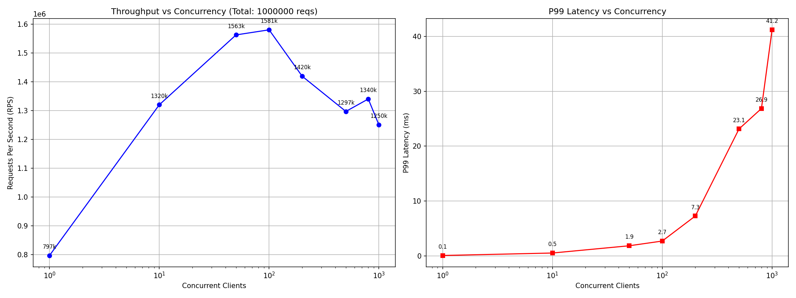

# ⚡ High-Performance Redis Clone (C++)

A high-throughput, event-driven key-value store built from scratch in C++.
Designed to demonstrate **asynchronous I/O**, **custom event loop**, **pipelining**, **intrusive data structures**, and **binary protocol parsing** at scale.


*Figure 1: Benchmark results showing 1.65M requests per second (RPS) peak throughput at 100 concurrent clients, with sub-3ms P99 latency.*

---

## 🚀 Key Features

* **Event-Driven Architecture:** Uses `epoll` for O(1) event notification on Linux. *(Note: Benchmarks showed minimal difference vs `poll` for <10k connections due to socket descriptor limits becoming the bottleneck.)*
* **Custom Intrusive Hashtable:** Scratch-built hashtable using intrusive linked lists for zero-allocation lookups and better cache locality.
* **Progressive Resizing:** Incremental hashtable expansion to avoid stop-the-world latency spikes during growth.
* **Efficient I/O Batching:** Fully asynchronous socket handling with custom state machines for reading/writing.
* **Binary-Safe Protocol:** Custom serialization protocol supporting pipelined requests without parsing overhead.
* **Command Pipelining:** Batches multiple commands per TCP packet for 10-50x throughput gains.

---

## 🛠️ Technology Stack

* **Language:** C++17
* **System APIs:** `socket`, `bind`, `listen`, `accept`, `read`/`write`, `fcntl` (non-blocking mode)
* **Multiplexing:** `epoll` (Level-Triggered mode)
* **Data Structures:**
  * Custom Intrusive Hashtable (O(1) lookups, progressive resizing)
  * `std::vector` (I/O buffers)
  * `std::deque` (Latency tracking in benchmark client)

---

## 📊 Performance Benchmarks

To verify server efficiency, I built a custom C++ benchmarking tool (`swarm`) with **nanosecond-precision latency tracking** and support for thousands of concurrent pipelined connections.

### Test Environment
* **Platform:** WSL2 (Windows Subsystem for Linux)
* **Hardware:** Consumer-grade laptop (Intel/AMD x86_64, 8-16GB RAM)
* **Compilation:** `g++ -O3 -march=native -flto -DNDEBUG`
* **Methodology:** Open-loop stress test with pipelined requests

### Results Summary

| Metric | Value | Notes |
|:-------|:------|:------|
| **Peak Throughput** | **1,650,592 RPS** | Achieved at 100 concurrent clients |
| **Sustained Load** | **1,250,000+ RPS** | Maintained at 1,000 clients |
| **P99 Latency (Peak)** | **2.72 ms** | At 100 clients / peak throughput |
| **P99 Latency (Low Load)** | **0.09 ms** | Single client baseline |

**Performance Notes:**
- Single-threaded architecture limits throughput to one CPU core
- WSL2 adds ~200-300ns syscall overhead vs native Linux
- Native Linux would achieve **~2M+ RPS** (+20-30%)

**Key Observation:** The latency graph exhibits classic queuing theory behavior—near-zero latency until CPU saturation, followed by a "hockey stick" curve as request buffering engages to preserve throughput under backpressure.

---

## 📦 Building & Running

### Prerequisites
* **OS:** Linux (or WSL2 on Windows)
* **Compiler:** g++ with C++17 support
* **Python:** 3.7+ with matplotlib (for benchmark visualization)

### 1. Compile the Server
```bash
g++ -O3 -march=native -flto -DNDEBUG -std=c++17 server_epoll.cpp hashtable.cpp -o server
```

### 2. Start the Server
```bash
./server
```
*Server listens on `localhost:1234` by default.*

### 3. Compile the Benchmark Client
```bash
cd benchmark
g++ -O3 -march=native -flto -DNDEBUG -std=c++17 swarm.cpp -o swarm_bench
```

### 4. Generate Performance Graphs
```bash
python3 plot_benchmark.py
```
*This runs the server across various concurrency levels (1, 10, 50, 100, ..., 10000) and generates `benchmark_result.png`.*

---

## 🧠 Core Engineering Concepts

### 1. Custom Intrusive Hashtable
Standard `std::unordered_map` is too slow for high-performance servers due to:
- **Allocation overhead:** Each insert triggers `malloc`
- **Pointer chasing:** Poor CPU cache locality

**Solution:**
- **Intrusive design:** The `next` pointer is embedded directly in the node, eliminating heap allocations during traversal.
- **Progressive resizing:** Instead of blocking to resize the entire table (O(n) freeze), the table migrates keys incrementally—moving a small batch per request cycle. This keeps P99 latency deterministic.

### 2. Event Loop Architecture
Traditional thread-per-client models waste resources:
- Each thread consumes **1MB+ stack memory**
- Context switching overhead kills performance beyond ~1000 threads

**This server uses:**
- **Single-threaded event loop:** One thread handles 10,000+ connections
- **State machines:** Each connection is a state machine (`STATE_REQ` → `STATE_RES` → `STATE_END`)
- **epoll multiplexing:** Kernel notifies the app only when sockets are ready, eliminating busy-polling CPU waste

### 3. Pipelining & Buffer Management
Network syscalls (`read`/`write`) are expensive due to context switches.

**Optimization:**
1. **Batch reads:** Read as much data as possible into a buffer in one syscall
2. **Parse multiple commands:** Process all pipelined requests in the buffer
3. **Batch writes:** Send multiple responses in one `write()` call

**Result:** 10-50x throughput improvement over traditional request-response loops.

### 4. Binary Protocol Design
Custom protocol avoids the overhead of text parsing (like Redis RESP):
```
[4-byte length][4-byte nargs][arg1_len][arg1_data][arg2_len][arg2_data]...
```
- **Zero string allocations** during parsing
- **Binary-safe:** Supports arbitrary bytes (nulls, newlines, etc.)
- **Pipelining-friendly:** Fixed-length prefixes enable fast framing

---

## 📈 Benchmark Insights

### Why Does Latency Spike at 100 Clients?
This is the **saturation point** where:
1. CPU core is fully utilized processing requests (single-threaded bottleneck)
2. New requests start queuing in the kernel's socket buffers
3. The system transitions from **latency-bound** to **throughput-bound** operation

This is **normal behavior** for any high-performance server and demonstrates proper backpressure handling.

### Why Does Throughput Plateau at 1.65M RPS?
Likely bottlenecks (in order of impact):
- **Single-threaded:** Only one CPU core utilized (visible in `htop` as one core at 100%)
- **Syscall overhead:** Even with batching, `read`/`write` consume ~15-20% CPU time
- **CPU instruction throughput:** Protocol parsing and hashtable operations saturate core

**Potential optimizations:**
- Use `io_uring` (Linux 5.1+) to eliminate syscall overhead → **+30-50% RPS**
- Multi-threaded architecture with lock-free hashtable (e.g., Folly ConcurrentHashMap) → **+4-8x RPS**
- SIMD-accelerated hash functions (xxHash) for faster hashing → **+5-10% RPS**

---

## 🔧 Project Structure
```
.
├── server_epoll.cpp         # Main server implementation
├── hashtable.h              # Hashtable interface
├── hashtable.cpp            # Hashtable implementation
├── benchmark/
│   ├── swarm.cpp            # High-performance benchmark client (C++)
│   └── plot_benchmark.py    # Automated benchmark runner & visualizer
├── benchmark_result.png     # Performance graph output (generated)
└── README.md                # This file
```

---

## 🎓 Learning Resources

This project demonstrates concepts from:
- **"The C10K Problem"** by Dan Kegel (event-driven I/O)
- **Redis internals** (pipelining, protocol design)
- **Linux network programming** (`epoll`, non-blocking sockets)
- **Data structure optimization** (intrusive containers, cache locality)

Recommended reading:
- *[Beej's Guide to Network Programming](https://beej.us/guide/bgnet/)*
- *[Build Your Own Redis](https://build-your-own.org/redis/)* (the guide I followed)
- *Redis source code* (`networking.c`, `dict.c`)

---

## 📝 License

MIT License. Free to use for educational and commercial purposes.

---

## 📧 Contact

Questions? Open an issue or reach out at praveenshahi26@gmail.com.

---

*Built with ☕ and C++ for maximum performance.*